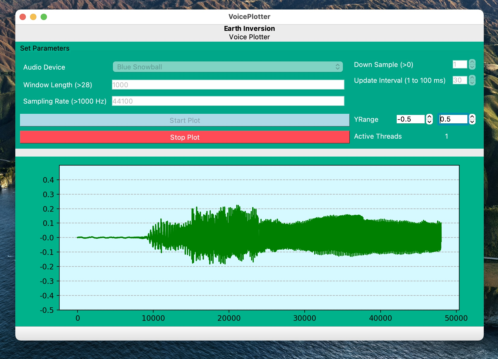

# Voice Plotter Application using PyQt5 and QT Designer

<p align="center">
  
</p>

## Installation & Run

### Using Anaconda

```
conda create -n voiceplotter
conda activate voiceplotter
pip install PyQt5 matplotlib sounddevice
python voicePlotter.py
```

### Using venv (in Python 3 only)

```
python3 -m venv voiceplotter
source voiceplotter/bin/activate
pip install PyQt5 matplotlib sounddevice
python voicePlotter.py
```
